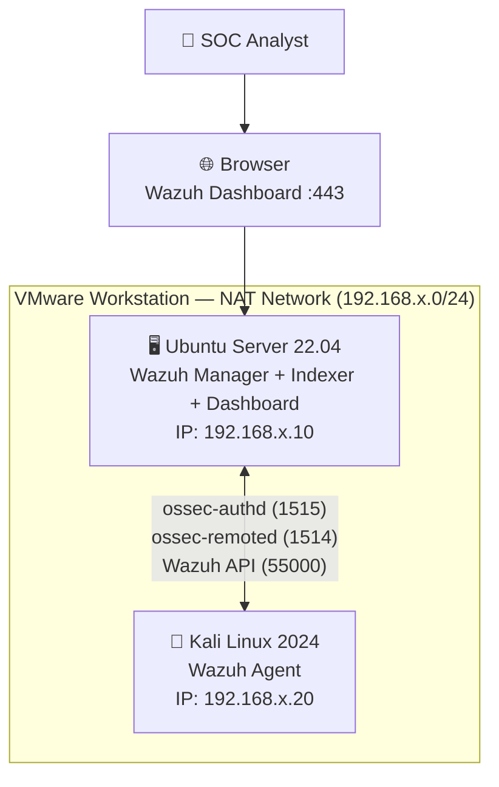
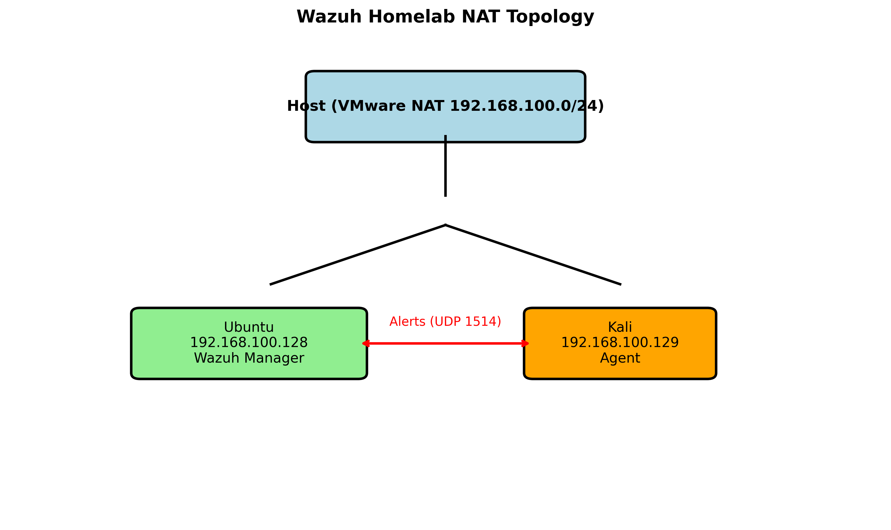

# 🛡️ SOC Analyst Portfolio: Wazuh Homelab (Active Agent + Alerts)

[](https://github.com/sagarbid/wazuh-homelab-soc/actions)
[](https://sagarbid.github.io/wazuh-homelab-soc)
[](LICENSE)
[](https://wazuh.com)
[](https://www.vmware.com)
[](https://www.comptia.org/certifications/security)

> A fully functional, hands-on Security Operations Centre (SOC) simulation built in a local VMware homelab. Demonstrates real-world SIEM capabilities: agent deployment, log ingestion, rule-based alerting, and MITRE ATT&CK mapping — directly applicable to **Melbourne IT security roles**.

---

## 📋 Executive Summary

This project provisions a complete Wazuh SIEM stack across two virtual machines connected via a NAT network, with a Kali Linux agent actively reporting security events to an Ubuntu Server manager. The lab simulates attack telemetry (port scans, login attempts) and demonstrates SOC analyst workflows: triage, investigation, and alert management.

**Why this matters for Melbourne SOC roles:**
- Hands-on SIEM administration (not just certification theory)
- Demonstrates log analysis, event correlation, and MITRE ATT&CK alignment
- Mirrors enterprise SOC tooling used by Telstra, ANZ, CBA, and Victorian Government agencies

---

## 🏗️ Architecture



### Network Topology



---

## ⚡ Quick Start

> Prerequisites: VMware Workstation Pro/Player, 8GB+ RAM, 60GB+ disk. See [01-prerequisites.md](docs/01-prerequisites.md).

### Step-by-Step Build

**1. Provision Ubuntu Server Manager VM**
```bash
# Minimum specs: 4 vCPU, 4GB RAM, 50GB disk
# OS: Ubuntu Server 22.04 LTS
```
Follow [02-ubuntu-manager.md](docs/02-ubuntu-manager.md)

**2. Install Wazuh All-in-One**
```bash
curl -sO https://packages.wazuh.com/4.7/wazuh-install.sh
sudo bash wazuh-install.sh -a
```

**3. Provision Kali Linux Agent VM**
```bash
# Minimum specs: 2 vCPU, 2GB RAM, 30GB disk
# OS: Kali Linux 2024.x
```
Follow [03-kali-agent.md](docs/03-kali-agent.md)

**4. Register and Enrol the Agent**
```bash
# On Kali — enrol agent (replace MANAGER_IP)
sudo /var/ossec/bin/agent-auth -m 192.168.x.10
sudo systemctl restart wazuh-agent
```

**5. Simulate Attacks and Trigger Alerts**
```bash
# Run the test script from Kali
sudo bash scripts/test-attacks.sh
```
Follow [04-test-alerts.md](docs/04-test-alerts.md)

**6. Access Wazuh Dashboard**
```
https://<MANAGER_IP>
Username: admin
Password: <generated during install — see wazuh-passwords.txt>
```

---

## 📸 Screenshots Gallery

### Installation & Setup

| VMware Installed | Wazuh Install Complete |
|---|---|
|  |  |

| Wazuh Dashboard | Two VMs Side by Side |
|---|---|
|  |  |

### Agent Deployment

| Wazuh Agent Installed on Kali | Kali Agent Active in Wazuh |
|---|---|
|  |  |

| Enrolled Kali Agent |
|---|
|  |

### Security Alerts

| Security Events | MITRE ATT&CK Dashboard |
|---|---|
|  |  |

| Security Events Exported |
|---|
|  |

### Network

| NAT Network Config | Ubuntu IP | Kali IP | Wazuh Server IP |
|---|---|---|---|
|  |  |  |  |

---

## 🛠️ Tech Stack

| Component | Technology | Purpose |
|---|---|---|
| **SIEM Manager** | Wazuh 4.x | Log collection, analysis, alerting |
| **Search Engine** | OpenSearch (built-in) | Event indexing and querying |
| **Dashboard** | Wazuh Dashboard (Kibana fork) | Visualisation, MITRE ATT&CK mapping |
| **Agent OS** | Kali Linux 2024 | Simulated endpoint / attack source |
| **Manager OS** | Ubuntu Server 22.04 LTS | Wazuh backend host |
| **Hypervisor** | VMware Workstation | VM orchestration |
| **Network** | VMware NAT | Isolated lab network |
| **CI/CD** | GitHub Actions | Docs deployment to GitHub Pages |

---

## 🎯 SOC Skills Demonstrated

- **Log Management** — Centralised syslog and ossec log ingestion from multiple OS types
- **Alert Triage** — Rule-based alerting with severity classification (level 3–15)
- **Threat Detection** — Port scan detection, brute-force identification, file integrity monitoring
- **MITRE ATT&CK** — Event correlation mapped to T-codes (e.g., T1046 Network Service Discovery)
- **Agent Lifecycle** — Full agent enrolment, registration, and health monitoring
- **Rule Customisation** — Custom `local_rules.xml` for organisation-specific detections
- **Incident Evidence** — Alert export and evidence packaging for escalation

---

## 🇦🇺 Melbourne SOC Job Relevance

This homelab directly mirrors tooling and workflows evaluated in Melbourne's security hiring market:

| Employer Sector | Relevant Skill Demonstrated |
|---|---|
| Big 4 Banks (ANZ, CBA, NAB, Westpac) | SIEM alert triage, log analysis, incident documentation |
| Telco (Telstra, Optus) | Agent deployment at scale, rule customisation |
| Victorian Government (DPC, Service Victoria) | ASD Essential 8 aligned controls, audit logging |
| Managed Security Providers (Tesserent, CyberCX) | Multi-tenant agent management, custom detection rules |

**Certifications aligned:** CompTIA Security+, CySA+, AZ-500, SC-200 (Microsoft Sentinel concepts transferable)

---

## 📁 Repository Structure

```
wazuh-homelab-soc/
├── README.md                    # This file
├── docs/
│   ├── 01-prerequisites.md      # Hardware, software requirements
│   ├── 02-ubuntu-manager.md     # Manager VM setup guide
│   ├── 03-kali-agent.md         # Agent VM setup guide
│   ├── 04-test-alerts.md        # Attack simulation & alert verification
│   └── 05-troubleshooting.md    # Common errors and fixes
├── screenshots/
│   ├── install/                 # VMware, dashboard setup
│   ├── agents/                  # Agent control, enrolment
│   ├── alerts/                  # Security events, MITRE dashboard
│   └── network/                 # NAT config, IP addresses
├── configs/
│   ├── ubuntu-config.yml        # Wazuh manager config reference
│   └── kali-ossec.conf          # Agent ossec.conf reference
├── diagrams/
│   └── wazuh_nat_topology.png   # Network diagram
├── scripts/
│   ├── test-attacks.sh          # Attack simulation script
│   └── cleanup-agents.sh        # Agent cleanup utility
└── .github/workflows/
    └── cd.yml                   # GitHub Pages deployment
```

---

## 🚀 Open in GitHub Codespaces

[](https://codespaces.new/sagarbid/wazuh-homelab-soc)

> **Note:** Codespaces opens the docs and scripts for review. The Wazuh stack requires VMware and cannot run inside Codespaces — use this for documentation browsing and script review only.

---

## 📄 License

MIT © 2025 Sagar Bidari — see [LICENSE](LICENSE)

---

*Built with 🛡️ as part of an active SOC Analyst job search in Melbourne, Australia.*
