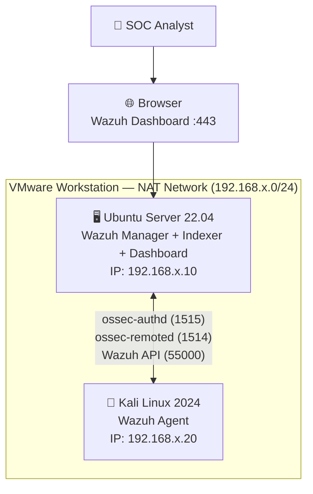

# 🛡️ SOC Analyst Portfolio: Wazuh Homelab (Active Agent + Alerts)

[](https://github.com/sagarbid/wazuh-homelab-soc/actions)
[](https://sagarbid.github.io/wazuh-homelab-soc)
[](LICENSE)
[](https://wazuh.com)
[](https://www.vmware.com)
[](https://www.comptia.org/certifications/security)

> A fully functional, hands-on Security Operations Centre (SOC) simulation built in a local VMware homelab. Covers agent deployment, log ingestion, rule-based alerting, attack simulation, and MITRE ATT&CK mapping — built from scratch with real commands and real screenshots.

---

## 📋 Executive Summary

This project provisions a complete Wazuh SIEM stack across two virtual machines connected via a VMware NAT network. A Kali Linux agent actively reports security events to an Ubuntu Server 22.04 manager running the Wazuh all-in-one stack (Manager + Indexer + Dashboard). The lab simulates realistic attack telemetry — port scans, SSH brute-force attempts, file integrity changes — and demonstrates core SOC analyst workflows: event ingestion, alert triage, rule customisation, and incident evidence collection.

Every step in this README was executed and verified. The commands shown are the exact commands used during the build.

---

## 🏗️ Architecture



### Network Topology


Both VMs sit on the same VMware NAT subnet, giving them internet access (for package installs) while remaining isolated from the physical network. The manager's IP is confirmed with `ip a` and used throughout as `MANAGER_IP`.

---

## ⚙️ Detailed Build — Exact Steps & Commands

### Phase 1 — VMware Setup

**1.1 Install VMware Workstation**

Download and install VMware Workstation Pro (free for personal use since May 2024) from:
```
https://www.vmware.com/products/workstation-pro.html
```

**1.2 Create Ubuntu Server VM**

In VMware: *Create a New Virtual Machine → Typical → Installer disc image file → select Ubuntu ISO*

Settings used:
```
Name:       Wazuh-Manager
CPUs:       2 processors × 2 cores = 4 vCPUs
RAM:        4096 MB
Disk:       50 GB (single file)
Network:    NAT
```

**1.3 Create Kali Linux VM**

Same wizard, different ISO:
```
Name:       Kali-Agent
CPUs:       2 processors × 1 core = 2 vCPUs
RAM:        2048 MB
Disk:       30 GB
Network:    NAT
```

---

### Phase 2 — Ubuntu Server (Wazuh Manager)

**2.1 Post-install system update**

```bash
sudo apt update && sudo apt upgrade -y
```

**2.2 Confirm network and note the manager IP**

```bash
ip a
# Note the IP shown on ens33 — this is MANAGER_IP
ping -c 3 8.8.8.8
```


**2.3 Download and run the Wazuh all-in-one installer**

```bash
curl -sO https://packages.wazuh.com/4.7/wazuh-install.sh
sudo bash wazuh-install.sh -a
```

This single command installs Wazuh Manager, Wazuh Indexer (OpenSearch), and Wazuh Dashboard. Install takes approximately 15 minutes. Credentials are printed at the end and stored in `wazuh-install-files.tar`.

**2.4 Extract and save the generated admin password**

```bash
sudo tar -O -xvf wazuh-install-files.tar wazuh-install-files/wazuh-passwords.txt
```

**2.5 Verify all three services are active**

```bash
sudo systemctl status wazuh-manager
sudo systemctl status wazuh-indexer
sudo systemctl status wazuh-dashboard
```

Expected output for each: `Active: active (running)`


**2.6 Confirm agent communication ports are listening**

```bash
sudo ss -tlnp | grep 1514   # ossec-remoted (agent data)
sudo ss -tlnp | grep 1515   # ossec-authd (agent registration)
sudo ss -tlnp | grep 55000  # Wazuh API
```

**2.7 Access the Wazuh Dashboard**

Open a browser on the host machine and navigate to:
```
https://<MANAGER_IP>
Username: admin
Password: <from wazuh-passwords.txt>
```

Accept the self-signed certificate warning. The dashboard loads with 0 agents connected — ready for enrolment.


---

### Phase 3 — Kali Linux (Wazuh Agent)

**3.1 Confirm Kali's IP and connectivity to the manager**

```bash
ip a
# Note Kali's IP on eth0

ping -c 3 <MANAGER_IP>
# Must succeed — confirms NAT routing works

nc -zv <MANAGER_IP> 1514
nc -zv <MANAGER_IP> 1515
# Both must show: Connection to <MANAGER_IP> 1514 port [tcp/*] succeeded!
```


**3.2 Add the Wazuh repository and install the agent**

```bash
# Import GPG key
curl -s https://packages.wazuh.com/key/GPG-KEY-WAZUH | \
  sudo gpg --dearmor -o /usr/share/keyrings/wazuh.gpg

# Add repository
echo "deb [signed-by=/usr/share/keyrings/wazuh.gpg] https://packages.wazuh.com/4.x/apt/ stable main" | \
  sudo tee /etc/apt/sources.list.d/wazuh.list

sudo apt update

# Install with manager IP pre-configured
sudo WAZUH_MANAGER='<MANAGER_IP>' apt install -y wazuh-agent
```


**3.3 Register the agent with the manager**

```bash
sudo /var/ossec/bin/agent-auth -m <MANAGER_IP>
```

Expected output:
```
INFO: Using agent name as: kali
INFO: Waiting for server reply
INFO: Valid key received
INFO: Connection successfully established
```

**3.4 Start and enable the agent service**

```bash
sudo systemctl enable wazuh-agent
sudo systemctl start wazuh-agent
sudo systemctl status wazuh-agent
# Expected: Active: active (running)
```


**3.5 Verify enrolment on the manager**

```bash
# On Ubuntu Manager
sudo /var/ossec/bin/agent_control -l
```

Expected output:
```
Wazuh agent_control. List of available agents:
   ID: 000, Name: wazuh-manager (server), IP: 127.0.0.1, Active/Local
   ID: 001, Name: kali, IP: 192.168.x.20, Active
```

The agent also appears as **Active** (green) in the Wazuh Dashboard under **Agents**.


---

### Phase 4 — Network Verification

**4.1 Confirm NAT network configuration in VMware**

In VMware: *Edit → Virtual Network Editor → VMnet8 (NAT)*


---

### Phase 5 — Attack Simulation & Alert Generation

**5.1 Port Scan — MITRE T1046 (Network Service Discovery)**

```bash
# From Kali Linux
sudo nmap -sV -p 22,443,1514,1515,55000 <MANAGER_IP>
sudo nmap -sS -T4 <MANAGER_IP>
```

Wazuh alert triggered: **Rule 533 — Nmap scan detected** (level 6)

**5.2 SSH Brute Force — MITRE T1110 (Brute Force)**

```bash
# Generate failed SSH authentication attempts
for i in {1..10}; do
  ssh -o StrictHostKeyChecking=no \
      -o ConnectTimeout=3 \
      -o PasswordAuthentication=no \
      baduser@<MANAGER_IP> 2>/dev/null || true
  sleep 0.5
done
```

Wazuh alert triggered: **Rule 5763 — Multiple failed SSH logins** (level 10)

**5.3 File Integrity Monitoring — MITRE T1565 (Data Manipulation)**

```bash
# Create, modify, delete a file in a monitored directory
sudo touch /etc/wazuh_fim_test.txt
echo "test content" | sudo tee /etc/wazuh_fim_test.txt
echo "modified" | sudo tee -a /etc/wazuh_fim_test.txt
sudo rm -f /etc/wazuh_fim_test.txt
```

Wazuh alerts triggered: **Rules 554, 550, 553** — file added / modified / deleted (level 7)

**5.4 Custom Rule Test**

On Ubuntu Manager — add to `/var/ossec/etc/rules/local_rules.xml`:
```xml
<group name="custom_soc_lab,">
  <rule id="100001" level="10">
    <match>SOC_LAB_TEST</match>
    <description>Custom SOC lab test event detected</description>
  </rule>
</group>
```

```bash
# Reload rules on manager
sudo systemctl restart wazuh-manager

# Trigger from Kali
logger -t "wazuh-soc-test" "SOC_LAB_TEST triggered from Kali"
```

**5.5 Run the automated test script**

```bash
# From Kali — runs all tests above in sequence
sudo bash scripts/test-attacks.sh <MANAGER_IP>
```

**5.6 View and export alerts**

```bash
# Real-time alert stream on manager
sudo tail -f /var/ossec/logs/alerts/alerts.json | python3 -m json.tool

# Export last 200 alerts to file
sudo tail -n 200 /var/ossec/logs/alerts/alerts.json > ~/exported-alerts.json
```


---

## 📸 Screenshots Gallery

### Installation & Setup

| VMware Installed | Wazuh Dashboard Login |
|---|---|
|  |  |

| Wazuh Dashboard | Two VMs Running |
|---|---|
|  |  |

### Agent Deployment

| Agent Installed | Kali Agent Active | Enrolled in Dashboard |
|---|---|---|
|  |  |  |

### Security Alerts

| Security Events | MITRE ATT&CK Dashboard | Exported Alerts |
|---|---|---|
|  |  |  |

### Network

| NAT Network Config | Ubuntu IP | Kali IP | Wazuh Server IP |
|---|---|---|---|
|  |  |  |  |

---

## 🛠️ Tech Stack

| Component | Technology | Purpose |
|---|---|---|
| **SIEM Manager** | Wazuh 4.x | Log collection, correlation, alerting |
| **Search Engine** | OpenSearch (built-in) | Event indexing and querying |
| **Dashboard** | Wazuh Dashboard (Kibana fork) | Visualisation, MITRE ATT&CK mapping |
| **Agent OS** | Kali Linux 2024 | Simulated endpoint and attack source |
| **Manager OS** | Ubuntu Server 22.04 LTS | Wazuh backend host |
| **Hypervisor** | VMware Workstation 17 | VM orchestration and NAT networking |
| **CI/CD** | GitHub Actions | Auto-deploy docs to GitHub Pages |

---

## 📁 Repository Structure

```
wazuh-homelab-soc/
├── README.md                    # This file
├── docs/
│   ├── 01-prerequisites.md      # Hardware, software, time requirements
│   ├── 02-ubuntu-manager.md     # Manager VM full setup guide
│   ├── 03-kali-agent.md         # Agent VM install and enrolment
│   ├── 04-test-alerts.md        # Attack simulation and verification
│   └── 05-troubleshooting.md    # Common errors and exact fixes
├── screenshots/
│   ├── install/                 # VMware, Wazuh install, dashboard
│   ├── agents/                  # Agent control, enrolment, active status
│   ├── alerts/                  # Security events, MITRE, exports
│   └── network/                 # NAT config, IP addresses, ping tests
├── configs/
│   ├── ubuntu-config.yml        # Wazuh manager config reference
│   └── kali-ossec.conf          # Agent ossec.conf reference
├── diagrams/
│   └── wazuh_nat_topology.png   # Full network topology diagram
├── scripts/
│   ├── test-attacks.sh          # Automated attack simulation (5 tests)
│   └── cleanup-agents.sh        # Remove disconnected agents from manager
└── .github/workflows/
    └── cd.yml                   # GitHub Pages deployment pipeline
```

---

## 🚀 Open in GitHub Codespaces

[](https://codespaces.new/sagarbid/wazuh-homelab-soc)

> **Note:** Codespaces is for reviewing docs and scripts. The Wazuh stack itself requires VMware and cannot run in a container environment.

---

## 💡 What This Project Taught Me — Learning Summary

Building this homelab from scratch was genuinely educational in ways that reading documentation alone never is. Here is what I actually learned through doing it.

### Understanding SIEM Architecture End-to-End

Before this project, SIEM was an abstract concept. After it, I understand the full data pipeline: a log event is generated on an endpoint, the Wazuh agent reads it from a file (e.g., `/var/log/auth.log`), ships it over TCP port 1514 to the manager, the manager runs it through the rules engine (comparing against hundreds of XML rule files), and if a rule matches at the configured alert level, the event is indexed into OpenSearch and visualised on the dashboard. Seeing each of those hops work in real time made the architecture concrete.

### How Agent Registration Actually Works

The `agent-auth` process — where the Kali agent connects to port 1515, exchanges a shared key with the manager using `ossec-authd`, and then begins encrypted communication on port 1514 — made public/private key infrastructure and secure channel establishment tangible. I had to troubleshoot a firewall blocking port 1515, which taught me to use `ss -tlnp`, `nc -zv`, and `ufw` together to diagnose connectivity.

### MITRE ATT&CK Is Not Just a Framework — It Is Operational

Watching an nmap scan I ran from Kali appear in the Wazuh dashboard as MITRE technique **T1046 (Network Service Discovery)** within seconds was a clear moment. The framework stopped being an academic reference and became a classification system I could see working. The same happened for T1110 (Brute Force) when the SSH loop triggered Rule 5763. I now understand how SOC teams use MITRE categories to prioritise and communicate threats.

### Rule Writing Teaches You How Detection Actually Works

Writing a custom rule in `local_rules.xml`, restarting the manager, triggering it with `logger`, and watching it fire on the dashboard made the detection logic completely clear. I understand how rules chain (parent rules, child rules), how severity levels (3–15) work, and how the `match`, `regex`, and `if_sid` fields control what gets alerted. This is the kind of knowledge that only comes from building it.

### Log Analysis Is a Hands-On Skill

Reading raw JSON from `/var/ossec/logs/alerts/alerts.json` and parsing it with `python3 -m json.tool` taught me the structure of a Wazuh alert: `rule.id`, `rule.level`, `rule.description`, `data.srcip`, `agent.name`, `timestamp`. Knowing that structure means I can write queries against it, export it, or pipe it into a SIEM integration. This is what a Tier 1 analyst does every shift.

### Networking Fundamentals Become Real When You Have to Configure Them

Getting the NAT network right — ensuring both VMs had internet access while being able to reach each other — required understanding VMware's virtual switch model, subnet routing, and default gateways. When pings failed, I used `ip route`, `ping`, and `traceroute` to isolate the problem. These are the same tools a SOC analyst uses when investigating lateral movement or suspicious network behaviour.

### Troubleshooting Under Pressure Builds Confidence

The dashboard not loading (OpenSearch was still indexing), the agent showing Disconnected (wrong manager IP in `ossec.conf`), and the install script stalling (low RAM) were all real blockers I solved by reading logs, searching documentation, and methodically isolating variables. That problem-solving process — not the clean final state — is what SOC work actually looks like.

### Security Certifications Become More Meaningful with Practical Context

Concepts from CompTIA Security+ (defence in depth, log monitoring, incident response) and CySA+ (threat hunting, SIEM analysis, rule tuning) that were previously abstract became grounded in practice. I can now connect a certification objective to a specific command I ran or a specific alert I investigated. That connection is what transforms exam knowledge into job readiness — for roles at Big 4 banks, telcos like Telstra and Optus, Victorian Government agencies, and Managed Security Providers like CyberCX and Tesserent who all rely on SIEM tooling in their SOC operations.

---

## 📄 License

MIT © 2025 Sagar Bidari — see [LICENSE](LICENSE)

---

*Built and documented hands-on as part of an active SOC Analyst career development path — Melbourne, Australia.*
